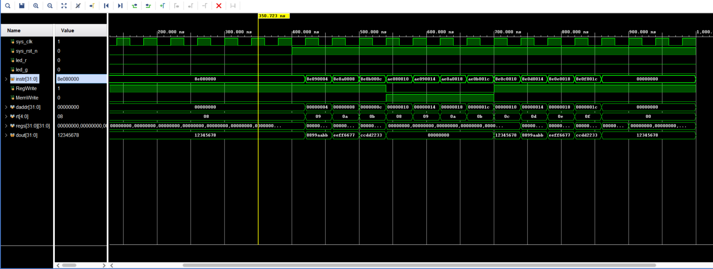
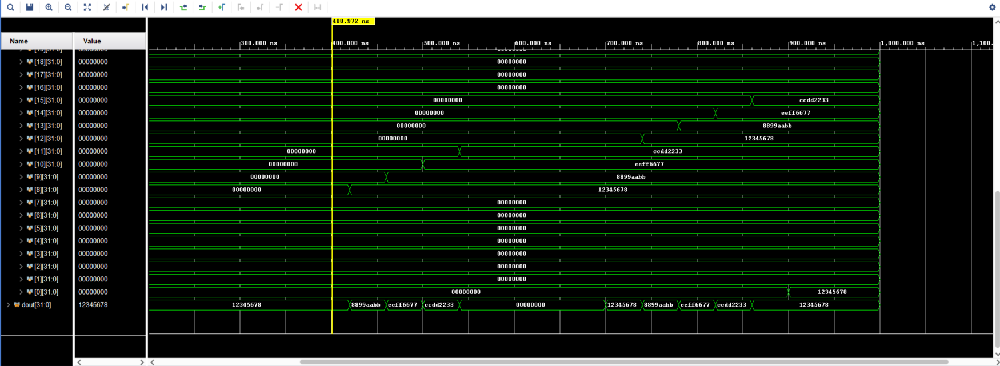
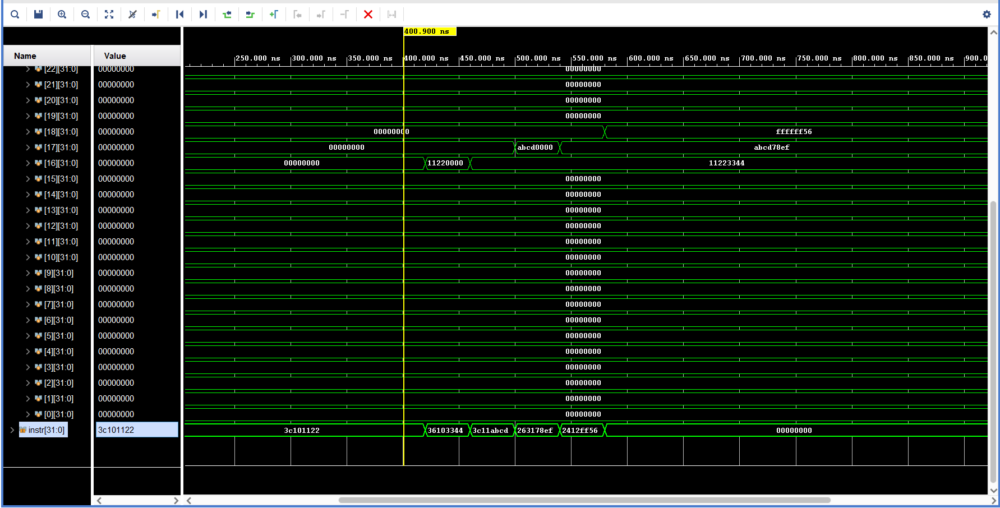
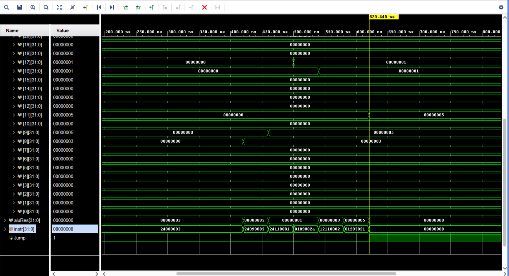
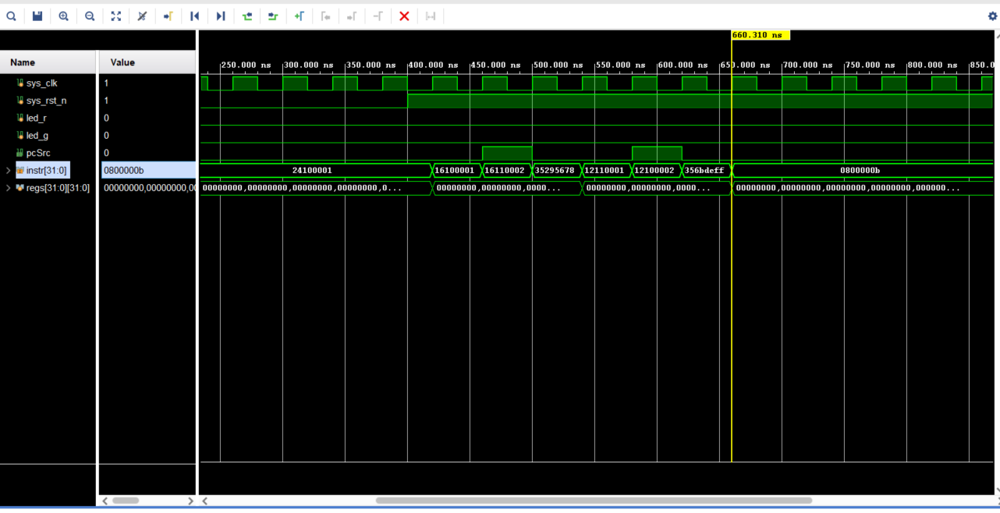

## 注意事项
1. 每次在vscode中创建sv文件后，要在vivado中添加文件
2. ip核修改coe文件后，有可能不生效，建议删除ip核重新添加
3. 注意小端和大端存储的区别（本项目使用小端存储，所以 inst_rom 和 data_ram 中**读出**和**写入**的数据要先转换，即little endian存储，big endian取出）
4. inst_rom, data_ram 使用的IP核是 distributed memory generator (depth = 256, width = 32)

## 辅助知识

### I-type 指令格式
| opcode | rs     | rt     | imm     |
|--------|--------|--------|--------|
| 31-26  | 25-21  | 20-16  | 15-0    |
| 6 bits | 5 bits | 5 bits | 16 bits |

### R-type 指令格式
| opcode | rs     | rt     | rd     | shamt  | funct  |
|--------|--------|--------|--------|--------|--------|
| 31-26  | 25-21  | 20-16  | 15-11  | 10-6   | 5-0    |
| 6 bits | 5 bits | 5 bits | 5 bits | 5 bits | 6 bits |

### J-type 指令格式
| opcode | address |
|--------|--------|
| 31-26  | 25-0    |
| 6 bits | 26 bits |

#### lw 指令
|    | opcode | rs     | rt     | imm     |
|----|--------|--------|--------|--------|
| lw | 100011 | rs     | rt     | imm     |
| sw | 101011 | rs     | rt     | imm     |

## 波形验证

### 1. lw & sw 指令
注意看instr的内容，是小端所以和coe文件中的内容不一样



注意看register的内容，最后写入reg[0]是因为op = 000000, RegWrite = 1 (正常不应该写入，继续完成其他指令会修改)



```verilog
case (opcode)
   6'b000000: begin // R-type instructions
       RegDst = 1'b1; // Write to rd
       RegWrite = 1'b1; // Enable register write
       case (funct)
           6'b100000: ALUOp = 3'b010; // ADD
           6'b100010: ALUOp = 3'b110; // SUB
           6'b100100: ALUOp = 3'b001; // AND
           6'b100101: ALUOp = 3'b001; // OR 
           default:   ALUOp = 3'b000; // Default case for unsupported funct 
       endcase
   end
```

### 2. I-type 指令(lui, ori, addiu)
注意看reg中的变化，和汇编代码中的变化一致



### 3. R-type 指令(slt, beq, addu(是I-type但是新实现的), j)

注意看reg中的变化，来判断 slt 和 addu 是否正确
注意看instr的变化，来判断 beq 和 j 是否正确




### 4. bne 指令

注意看instr的变化，来判断 bne 是否正确

