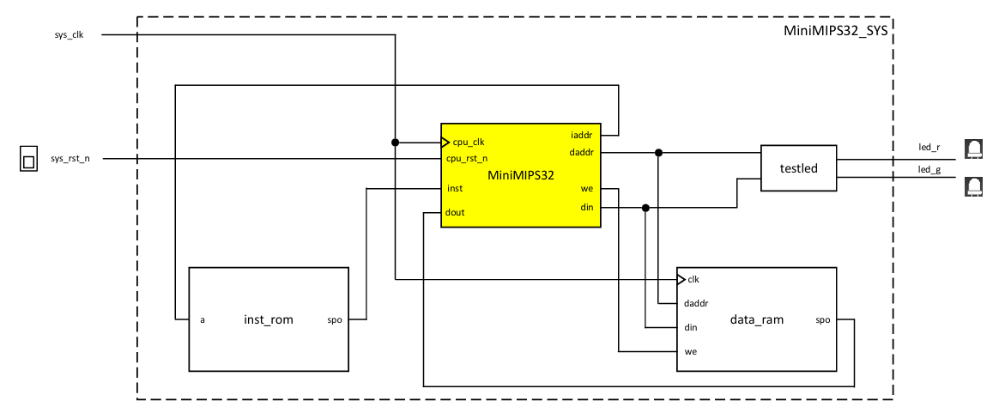
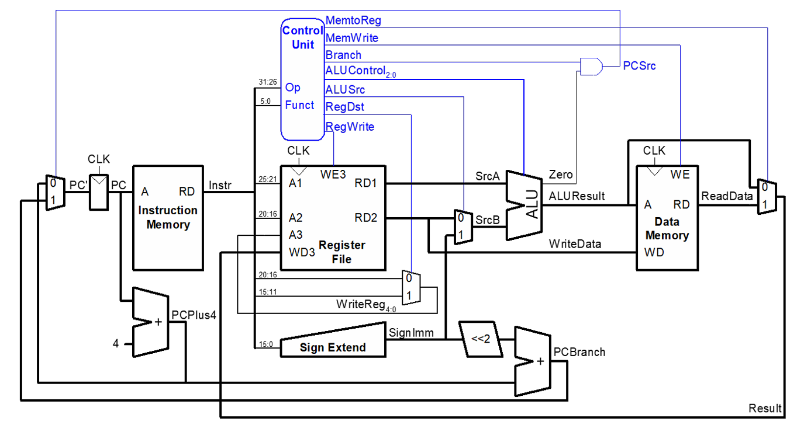
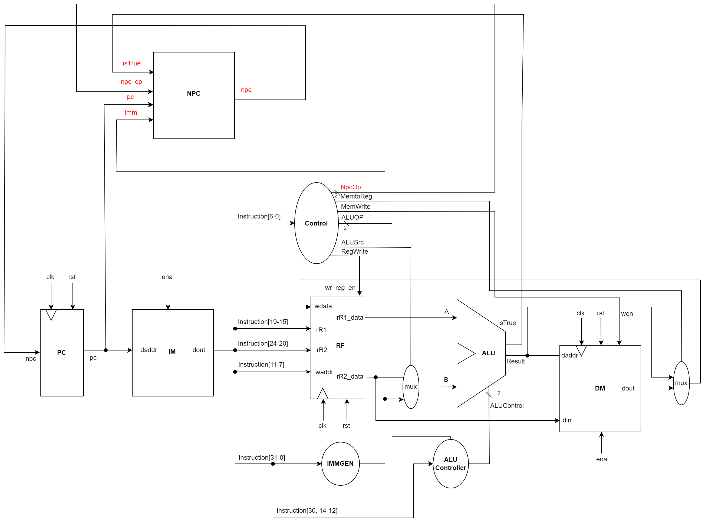
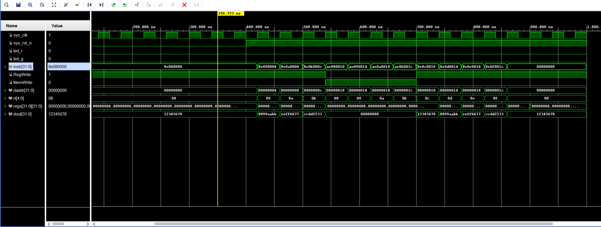
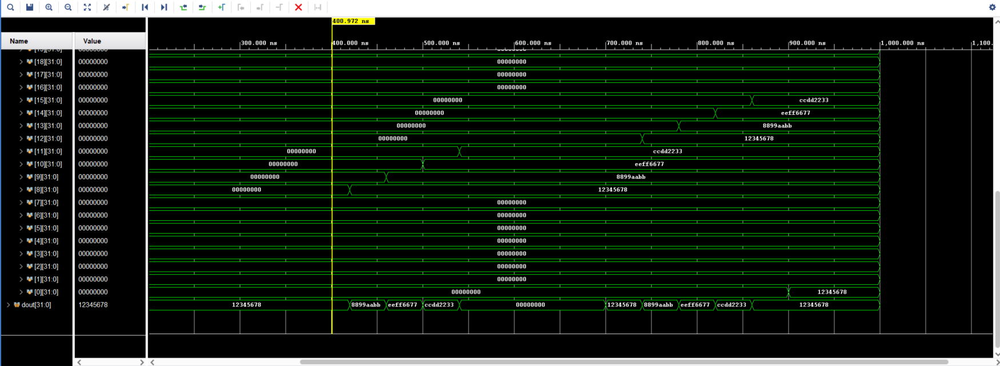
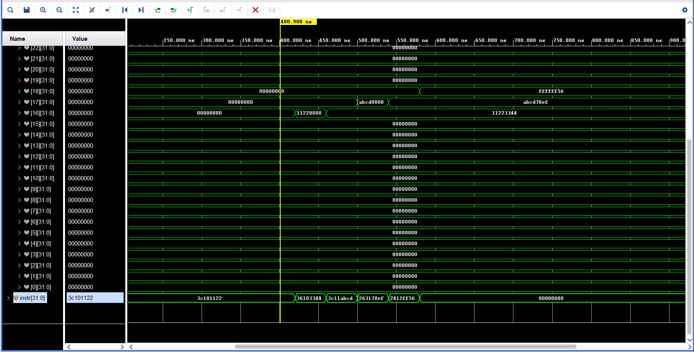
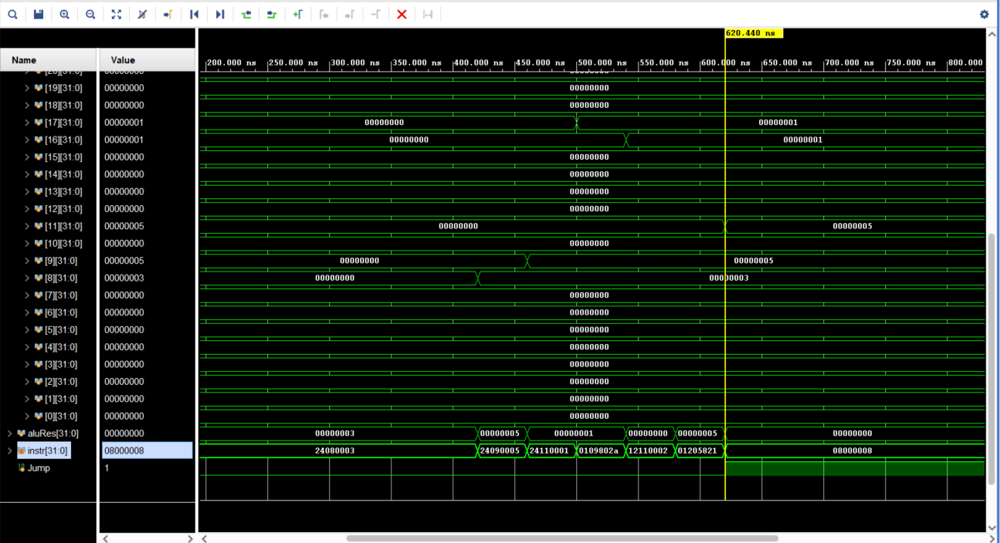
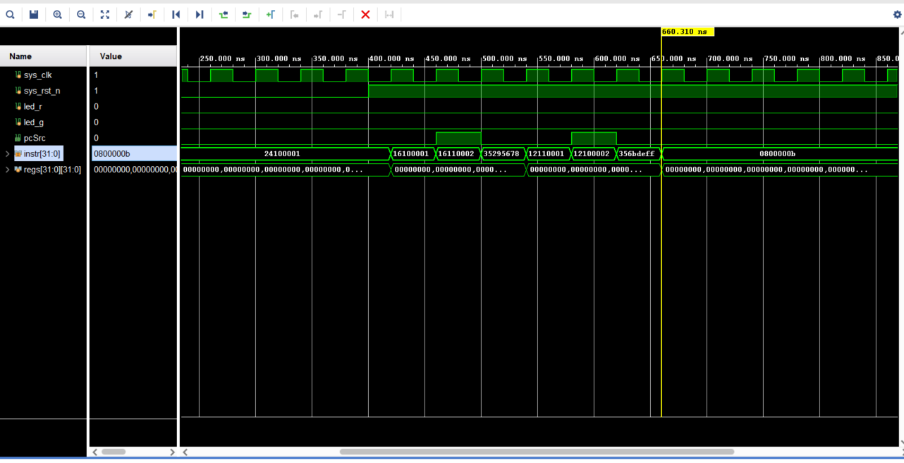
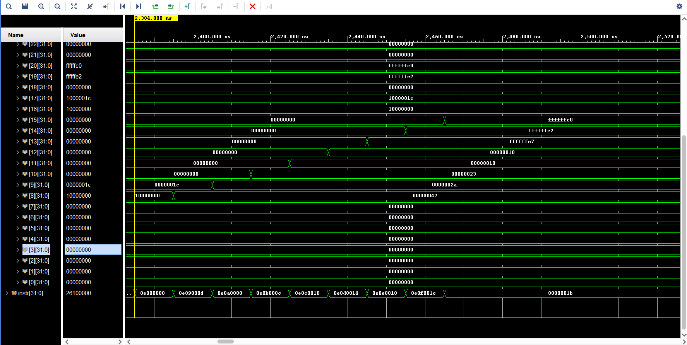
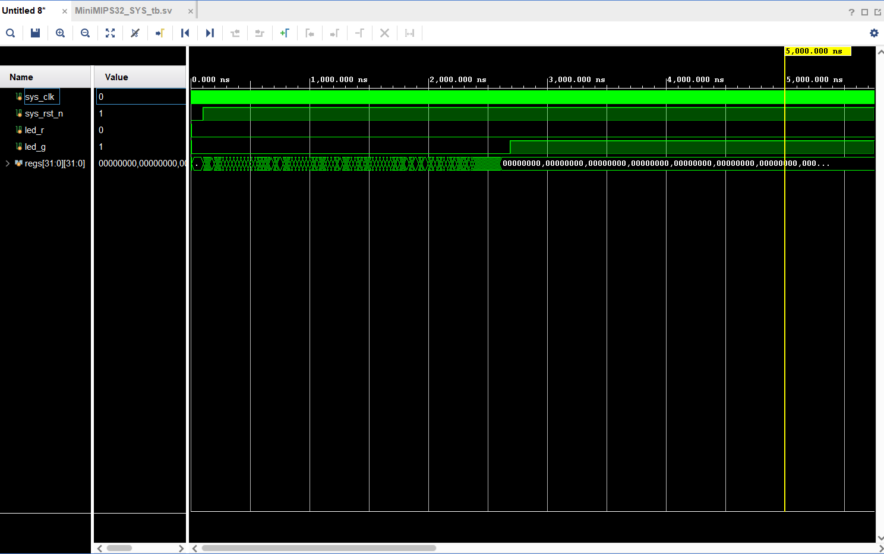

## 注意事项
1. 每次在vscode中创建sv文件后，要在vivado中添加文件
2. ip核修改coe文件后，有可能不生效，建议删除ip核重新添加
3. 注意小端和大端存储的区别（本项目使用小端存储，所以 inst_rom 和 data_ram 中**读出**和**写入**的数据要先转换，即little endian存储，big endian取出）
4. inst_rom, data_ram 使用的IP核是 distributed memory generator (depth = 256, width = 32)
5. 仿真时间默认10us，需要再点击播放键，会继续仿真直到 ```$stop```
6. 观察波形图会发现，当rst=0时，这时PC=0x00000000，因为inst_rom时没有使能端口的，所以会读出instruction，也就进行了译码执行等等环节，但是由于rst=0，不会写回regfile，但是当rst=1时，会直接写入，所以就是比正常的cpu快一个周期
7. module的名字和实例化的名字不要一致，比如```cpu cpu(...);```，因为这样就没办法使用vscode跳转

## 辅助知识

### I-type 指令格式
| opcode | rs     | rt     | imm     |
|--------|--------|--------|--------|
| 31-26  | 25-21  | 20-16  | 15-0    |
| 6 bits | 5 bits | 5 bits | 16 bits |

### R-type 指令格式
| opcode | rs     | rt     | rd     | shamt  | funct  |
|--------|--------|--------|--------|--------|--------|
| 31-26  | 25-21  | 20-16  | 15-11  | 10-6   | 5-0    |
| 6 bits | 5 bits | 5 bits | 5 bits | 5 bits | 6 bits |

### J-type 指令格式
| opcode | address |
|--------|--------|
| 31-26  | 25-0    |
| 6 bits | 26 bits |

#### lw 指令
|    | opcode | rs     | rt     | imm     |
|----|--------|--------|--------|--------|
| lw | 100011 | rs     | rt     | imm     |
| sw | 101011 | rs     | rt     | imm     |

## 框架图

整个CPU的设计核心在于根据框架图，完成各个模块的设计和连接。

总框架图：




如下是第一版的框架图:



NPC的实现参考如下：



## 波形验证

### 1. lw & sw 指令
注意看instr的内容，是小端所以和coe文件中的内容不一样



注意看register的内容，最后写入reg[0]是因为op = 000000, RegWrite = 1 (正常不应该写入，继续完成其他指令会修改)



```verilog
case (opcode)
   6'b000000: begin // R-type instructions
       RegDst = 1'b1; // Write to rd
       RegWrite = 1'b1; // Enable register write
       case (funct)
           6'b100000: ALUOp = 3'b010; // ADD
           6'b100010: ALUOp = 3'b110; // SUB
           6'b100100: ALUOp = 3'b001; // AND
           6'b100101: ALUOp = 3'b001; // OR 
           default:   ALUOp = 3'b000; // Default case for unsupported funct 
       endcase
   end
```

### 2. I-type 指令(lui, ori, addiu)
注意看reg中的变化，和汇编代码中的变化一致



### 3. R-type 指令(slt, beq, addu(是I-type但是新实现的), j)

注意看reg中的变化，来判断 slt 和 addu 是否正确
注意看instr的变化，来判断 beq 和 j 是否正确




### 4. bne 指令

注意看instr的变化，来判断 bne 是否正确




### sort.S (冒泡排序 综合测试)

先使用 sim/inst_rom.coe 和 sim/data_ram.coe 进行仿真，因为这里面的指令较少，方便观察波形图，无误后使用 board/inst_rom.coe 和 board/data_ram.coe 进行仿真，就可以发现 led_g 为 1，表示排序成功，通过测试！


注意看reg中的变化，来判断是否正确，可以看到寄存器```$t0 ~ $t7```的值按序排列了，成功！



在阅读波形图的时候，下面的 表格、汇编&指令的对应 可以帮助你理解 指令 和 寄存器 的变化
<details>
<summary>表格、汇编&指令的对应</summary>

| | |
|------- |-----|
|reg[8]  | $t0 |
|reg[9]  | $t1 |
|reg[10] | $t2 |
|reg[11] | $t3 |
|reg[12] | $t4 |
|reg[13] | $t5 |
|reg[14] | $t6 |
|reg[15] | $t7 |
|reg[16] | $s0 |
|reg[17] | $s1 |
|reg[19] | $s3 |
|reg[20] | $s4 |


``` assembly
0010103c    lui s0,0x1000
00001026    addiu s0,s0,0
1c001136    ori $s1,$s0,0x1C

sort_loop:
0000138e    lw $s3,0($s0)  
0000348e    lw $s4,0($s1)
2a407402    slt $t0,$s3,$s4
02000011    beq $t0,$0,sort_next 
000033ae    sw $s3, 0($s1)
000014ae    sw $s4, 0($s0)

sort_next:
fcff3126    addiu $s1, $s1, -4  
f8ff1116    bne $s0, $s1, sort_loop  

04001026    addiu $s0,$s0,4     
0010083c    lui t0,0x1000
00000825    addiu t0,t0,0
1c000934    ori $t1,$zero,0x1C
21880901    addu $s1,$t0,$t1
f2ff1116    bne $s0, $s1, sort_loop 

0010103c    lui s0,0x1000
00001026    addiu s0,s0,0

0000088e    lw $t0,  0($s0)
0400098e    lw $t1,  4($s0)
08000a8e    lw $t2,  8($s0)
0c000b8e    lw $t3, 12($s0)
10000c8e    lw $t4, 16($s0)
14000d8e    lw $t5, 20($s0)
18000e8e    lw $t6, 24($s0)
1c000f8e    lw $t7, 28($s0)
1b000008    j sort_end    
```
</details>

最终在 board 上测试成功，led_g 亮起，表示排序成功！



修改tb文件，以便于测试重置后是否能够再次正常运行，修改部分如下：
```verilog  
   `define CLK_PERIOD 10
   ...other code...
   initial begin
      // Initialize Inputs
      sys_clk = 0;
      sys_rst_n = 0;
      #100
      sys_rst_n = 1;     

      #3000

      sys_rst_n = 0;
      #100
      sys_rst_n = 1;
      #3000 $stop;
   end
```

此时发现的一个**问题**，重置后，led_g 不会亮起，发现是因为
sort_board.S中有如下指令：
```assembly
   li $a1, 0x80040000	   // 0480053c                     
   li $a2, 0x80000000	   // 0080063c
   ...
   sort_end:
   sw $a0, 0($a1)   // 0000a4ac
   j sort_end       // 30000008

   ERROR:
   sw $a0, 0($a2)   // 0000c4ac
   j ERROR          // 32000008
```
看似将数据存储在了 地址 0x80040000(正确) 或 0x80000000(错误)，但是根据**coe文件的读取原理**，9位之前被舍弃，所以二者都是将数据存储在了 **地址0** 中，导致重置后第二次运行，在 地址0 读取了错误的数据（即$a0中的值=1）

<details>
<summary>coe文件的读取原理</summary>

第一行的内容存放在地址0中，第二行的内容存放在地址1中，这也是为什么top.sv文件中使用iaddr[9:2]、daddr[9:2] (按照字节对齐)，而不是iaddr[7:0]、daddr[7:0]
```verilog
    inst_rom inst_rom (
        .a(iaddr[9:2]),      // input wire [9 : 2] a
        .spo(instr_little)  // output wire [31 : 0] spo
    );
    
    data_ram data_ram (
        .a(daddr[9:2]),      // input wire [9 : 2] a
        .d(din_little),      // input wire [31 : 0] d
        .clk(sys_clk),  // input wire clk
        .we(MemWrite),    // input wire we
        .spo(dout_little)  // output wire [31 : 0] spo
    );
```
</details>

这个没法弄，除非改$a1和$a2的值，需要加2条指令，将$a1和$a2值的低位改为 >20 比如
```assembly 
ori $a1, $a1, 0x40(0x44 0x48 ...)
ori $a2, $a2, 0x44(0x44 0x48 ...)
```
为了避免污染地址0--15的数据